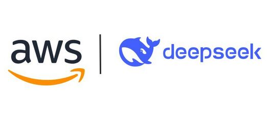

  
  <h1 style="margin: 0px auto;"> Deployment deepseek on AWS </h1>
  
  

## 🚀 **Welcome to This Creative and Technical Workshop!**  

Are you ready to transform Amazon Elastic Compute Cloud (EC2) into a powerful remote development environment? With **Visual Studio Code (VS Code)**, you'll master every connection between your local machine and cloud servers.  

Whether you're a **software developer**, **DevOps engineer**, or simply a tech enthusiast, this workshop offers:  
- **Advanced connection techniques:** Work with EC2 remotely, seamlessly, and securely.  
- **Enhanced coding experience:** Turn any EC2 instance into your "workspace."  
- **Boundless creativity:** Deploy intuitive and robust development environments on the cloud.  

---

## 🔥 Workshop Highlights
- **📡 Connect to EC2 Anywhere:** Access both public and private instances securely.  
- **⚙️ Customize Your Environment:** Deploy, configure, and build unique coding setups.  
- **🌐 Host VS Code on the Web:** Create a web-accessible version of VS Code to work from any device.  
- **🛠️ Modern Tools and Technologies:** Integrate AWS Systems Manager, Instance Connect Endpoint, and CloudFront.  

---

## 🧩 Key Features of the Workshop

### 1. Explore AWS EC2
- Learn everything about Amazon EC2, from basics to advanced.  
- Techniques for working with both public and private instances.  

### 2. Master Visual Studio Code 
- Use VS Code as your primary IDE for remote projects.  
- Leverage the *Remote SSH* extension and other powerful tools.  

### 3. Build Customized Solutions 
- Learn to create AMIs (Amazon Machine Images) for quick and efficient deployments.  
- Deploy VS Code or Code Server via EC2 and CloudFront.  

---

## 🎯 **Workshop Objectives**
- **Learn fast:** Get hands-on with EC2 remote coding techniques in just a few hours.  
- **Practice real-world scenarios:** Apply your knowledge immediately with practical exercises.  
- **Connect with peers:** Discuss and collaborate with experts and like-minded developers.  

---

Let’s start and conquer every challenge together! ✨
